# OpenFactstore — User Setup & Activity Guide

> **Documentation-as-Code:** The screenshots in this guide are generated automatically by the Playwright E2E test suite. Run `npm run test:e2e` from the `frontend/` directory (with the dev server running) to refresh them.

---

## Table of Contents

1. [Introduction](#1-introduction)
2. [Prerequisites](#2-prerequisites)
3. [Navigating the UI](#3-navigating-the-ui)
4. [Dashboard](#4-dashboard)
5. [Managing Flows](#5-managing-flows)
6. [Asserting Compliance](#6-asserting-compliance)
7. [Evidence Vault](#7-evidence-vault)
8. [Environments](#8-environments)
9. [Logical Environments](#9-logical-environments)
10. [Audit Log](#10-audit-log)
11. [Deployment Policies](#11-deployment-policies)
12. [Compliance Frameworks](#12-compliance-frameworks)
13. [Drift Detection](#13-drift-detection)
14. [Search](#14-search)
15. [Troubleshooting](#15-troubleshooting)

---

## 1. Introduction

OpenFactstore is an open-source **Supply Chain Compliance Fact Store** for teams operating in regulated environments. The web UI gives engineers and compliance officers a single place to:

- **Define** delivery processes (Flows) with mandatory quality gates.
- **Browse** build records (Trails) and the artifacts they produced.
- **Assert** whether a specific container image digest is compliant before deployment.
- **Inspect** evidence files (test reports, scan results, approval decisions) attached to each build.
- **Monitor** deployment environments for drift and policy violations.
- **Search** across all artifacts, trails, and attestations in seconds.

This guide walks through every key activity in the UI using the same paths covered by the automated Playwright test suite.

---

## 2. Prerequisites

Before starting, ensure the following are available:

| Requirement | Version | Notes |
|-------------|---------|-------|
| **Java** | 21+ (Eclipse Temurin recommended) | Required to run the backend |
| **Node.js** | 20+ | Required for the frontend dev server |
| **Docker** | Any recent version | Optional — enables `docker-compose up` for the full stack |
| A modern browser | Chrome / Edge / Firefox | The UI targets desktop viewports |

### Starting the full stack

**Option A — Docker Compose (recommended)**

```bash
git clone https://github.com/MaximumTrainer/OpenFactstore.git
cd OpenFactstore
docker-compose up
```

The UI is then available at **http://localhost:5173** and the API at **http://localhost:8080**.

**Option B — From source**

```bash
# Terminal 1 — backend
cd backend
./gradlew bootRun

# Terminal 2 — frontend
cd frontend
npm ci
npm run dev
```

> **Note:** The frontend dev server proxies all `/api` requests to `http://localhost:8080`. Ensure the backend is running before using any data-dependent features.

---

## 3. Navigating the UI

All pages are reachable from the persistent navigation bar at the top of the screen.

**Key Elements in the NavBar:**

| Link / Section | Destination |
|----------------|-------------|
| **OpenFactstore** (logo) | `/` — Dashboard |
| **Flows** | `/flows` — Flow list |
| **Assert** | `/assert` — Compliance assertion form |
| **Evidence** | `/evidence` — Evidence Vault |
| **Environments** | `/environments` — Environment list |
| **Logical Envs** | `/logical-environments` — Logical environment groupings |
| **Audit** | `/audit` — Audit log |
| **Policies** | `/policies` — Deployment policies |
| **Compliance** | `/compliance` — Compliance frameworks |
| **Drift** | `/drift` — Environment drift detection |
| **Search** | `/search` — Global search |

---

## 4. Dashboard

**Navigate to:** `/`

The Dashboard provides an at-a-glance summary of your delivery pipeline's compliance health.

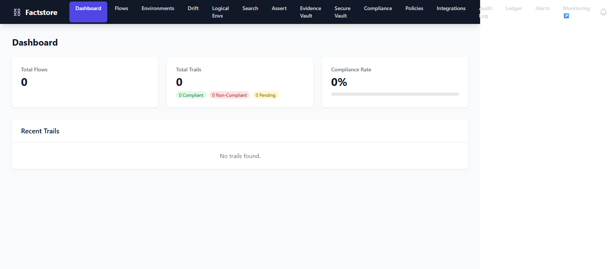

### Key Elements

| Element | Description |
|---------|-------------|
| **Total Flows** card | Count of registered delivery pipelines |
| **Total Trails** card | Count of all build records, with breakdowns for Compliant, Non-Compliant, and Pending |
| **Compliance Rate** card | Percentage of completed builds that are compliant, visualised as a colour-coded progress bar (green ≥ 80%, yellow ≥ 50%, red < 50%) |
| **Recent Trails** table | The 5 most recent trails — shows commit SHA prefix, branch, author, date, and compliance status badge |

### Activity: Reviewing recent build status

1. Navigate to `/`.
2. Scan the **Compliance Rate** card to get an overall health signal.
3. Review the **Recent Trails** list for any `NON_COMPLIANT` or `PENDING` entries.
4. Click any trail row to open its detail view.

---

## 5. Managing Flows

**Navigate to:** `/flows`

A **Flow** represents a repeatable software delivery process. It defines which attestation types (e.g. `junit`, `snyk`, `trivy`) must be present and passing before an artifact may be deployed.

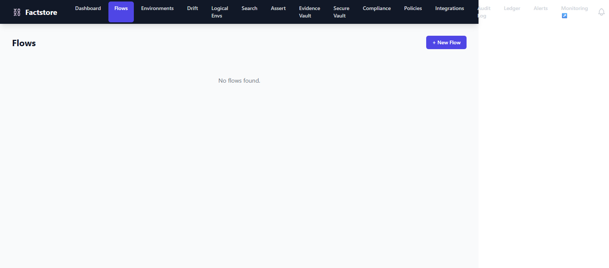

### Key Elements

| Element | Description |
|---------|-------------|
| **+ New Flow** button | Opens the flow creation modal |
| Flows table | Shows name, description, visibility (public/private), required attestation types, tags, and action buttons |
| **Edit** / **Delete** actions | Modify or remove a flow (delete only works when no trails are attached) |

### Activity: Creating a new Flow

1. Navigate to `/flows`.
2. Click **+ New Flow**.
3. Fill in:
   - **Name** — unique identifier for this pipeline (e.g. `payment-service`).
   - **Description** — human-readable summary.
   - **Required Attestation Types** — comma-separated list (e.g. `junit,snyk`).
4. Click **Create**.

> **Tip:** Use the `Visibility` field to mark a Flow as `private` if it should only be visible within your organisation.

### Activity: Viewing Flow details

1. Click a flow's name in the table.
2. The detail view shows all trails for that flow, their compliance status, and the required attestation types.

---

## 6. Asserting Compliance

**Navigate to:** `/assert`

The Assert page lets you ask: _"Is this specific container image compliant with the requirements of a given Flow?"_

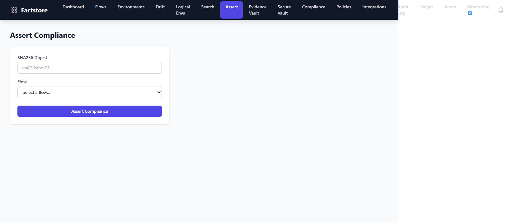

### Key Elements

| Element | Description |
|---------|-------------|
| **SHA256 Digest** field | Accepts a full image digest in the form `sha256:<64-hex-chars>` |
| **Flow** dropdown | Selects the Flow whose requirements to evaluate against |
| **Assert Compliance** button | Submits the assertion |
| Result panel | Shows `✓ COMPLIANT` (green) or `✗ NON_COMPLIANT` (red) with a breakdown of which attestations are satisfied/missing |

### Activity: Asserting before a deployment

1. Navigate to `/assert`.
2. Paste the container image digest (e.g. `sha256:abc123...`) into the **SHA256 Digest** field.
3. Select the relevant **Flow** from the dropdown.
4. Click **Assert Compliance**.
5. Review the result panel:
   - **COMPLIANT** — all required attestation types are present and passing.
   - **NON_COMPLIANT** — one or more required attestation types are missing or failed.

> **Warning:** A `NON_COMPLIANT` result means the artifact should not be deployed until the missing evidence is provided or failures are resolved.

---

## 7. Evidence Vault

**Navigate to:** `/evidence`

The Evidence Vault lists every evidence file that has been attached to an attestation — test XML reports, SARIF scan results, approval documents, and more.

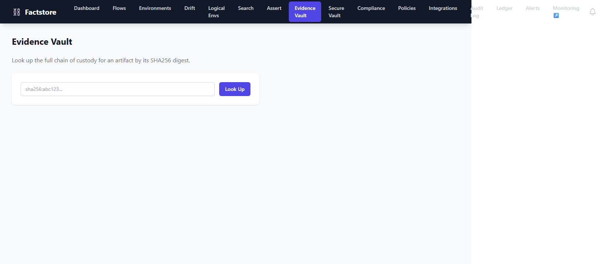

### Key Elements

| Element | Description |
|---------|-------------|
| Evidence file list | Shows file name, associated attestation type, content hash, and upload timestamp |
| Filter controls | Filter by attestation type or search by file name |
| **Download** action | Retrieve the original evidence payload |

### Activity: Locating a specific evidence file

1. Navigate to `/evidence`.
2. Use the filter controls to narrow by attestation type (e.g. `snyk`).
3. Click the file name or **Download** to inspect the raw evidence payload.

---

## 8. Environments

**Navigate to:** `/environments`

Environments represent named deployment targets (e.g. `production`, `staging`, `uat`). Each environment holds a **snapshot** — a point-in-time record of which artifact digests are currently running there.

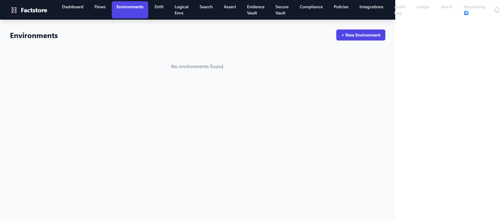

### Key Elements

| Element | Description |
|---------|-------------|
| Environments table | Lists environment name, current snapshot timestamp, and artifact count |
| **+ New Environment** button | Register a new deployment target |
| Row click → Detail view | Shows the full artifact snapshot for that environment |

### Activity: Checking what is deployed in production

1. Navigate to `/environments`.
2. Click the `production` environment row.
3. The detail view shows every artifact digest currently recorded in that environment's latest snapshot, along with their compliance status.

> **Note:** Snapshots are updated by your CI/CD pipeline via the API. A stale snapshot may not reflect the current live state.

---

## 9. Logical Environments

**Navigate to:** `/logical-environments`

Logical Environments group one or more physical environments under a single named abstraction (e.g. `eu-region` encompasses `eu-prod-1` and `eu-prod-2`). This enables cross-environment compliance checks at a higher level of granularity.

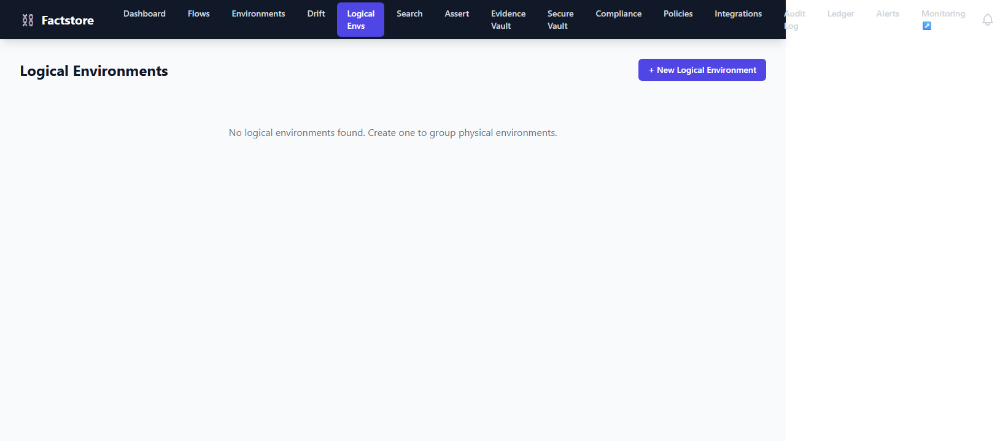

### Key Elements

| Element | Description |
|---------|-------------|
| Logical environment list | Name, description, and the physical environments it contains |
| **+ New Logical Environment** button | Create a new grouping |
| Detail view | Shows aggregate compliance status across all member environments |

### Activity: Creating a logical environment group

1. Navigate to `/logical-environments` via the **Logical Envs** nav link.
2. Click **+ New Logical Environment**.
3. Provide a name and select the physical environments to include.
4. Click **Create**.

---

## 10. Audit Log

**Navigate to:** `/audit`

The Audit Log provides a tamper-evident, append-only record of every mutation in the system — flow creation, trail updates, attestation submissions, deployment snapshots, and more.

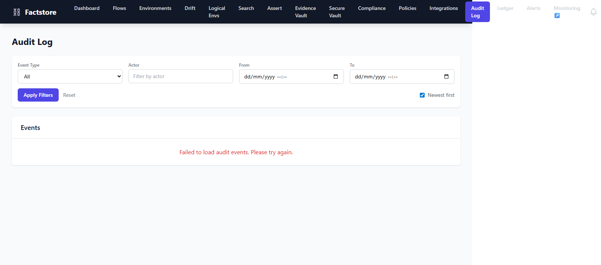

### Key Elements

| Element | Description |
|---------|-------------|
| **Event Type** filter | Dropdown to scope the log to a specific event class |
| **Filter by actor** field | Free-text filter on the identity that triggered the event |
| Log entries | Timestamped list of events with actor, resource type, and resource ID |

### Activity: Investigating a compliance breach

1. Navigate to `/audit`.
2. Set **Event Type** to `ATTESTATION_SUBMITTED` to find recently attached evidence.
3. Filter by the actor (CI job name or user identity) responsible for the build in question.
4. Inspect the matching entries to trace the timeline of attestation submissions.

---

## 11. Deployment Policies

**Navigate to:** `/policies`

Deployment Policies define machine-readable rules — backed by OPA (Open Policy Agent) expressions — that gate whether an artifact may be promoted to an environment.

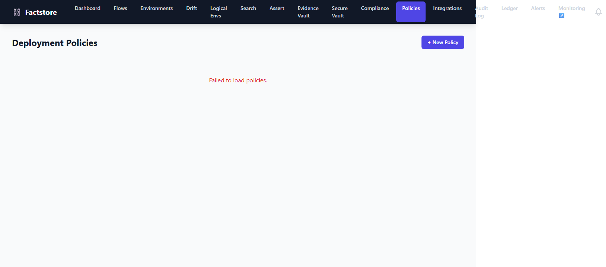

### Key Elements

| Element | Description |
|---------|-------------|
| Policies table | Name, type, threshold, signature required flag, evaluator (e.g. `OPA`) |
| **+ New Policy** button | Opens the policy creation modal |
| **Edit** / **Delete** actions | Modify or remove an existing policy |

### Activity: Creating a policy that requires a security scan

1. Navigate to `/policies`.
2. Click **+ New Policy**.
3. Configure:
   - **Name** — e.g. `require-snyk-scan`.
   - **Type** — `ATTESTATION_REQUIRED`.
   - **Evaluator** — `OPA`.
   - **Expression** — OPA Rego rule body.
4. Click **Create**.
5. Attach the policy to the relevant Flow.

> **Tip:** Use `factstore.cqrs.role` to deploy a read-only query replica that evaluates policies without affecting the write path.

---

## 12. Compliance Frameworks

**Navigate to:** `/compliance`

The Compliance Frameworks page lets you browse pre-built framework templates (e.g. ISO 27001, SOC 2, PCI DSS) and import them directly as Flows — so your pipelines are pre-wired with all the required attestation types for a given regulation.

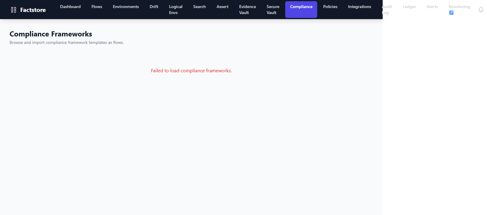

### Key Elements

| Element | Description |
|---------|-------------|
| Framework cards | Name, description, and required attestation type count |
| **Import as Flow** button | Creates a new Flow pre-populated with the framework's required attestations |

### Activity: Bootstrapping a PCI DSS pipeline

1. Navigate to `/compliance`.
2. Find the **PCI DSS** card.
3. Click **Import as Flow**.
4. Optionally adjust the flow name and description.
5. Confirm — your new Flow is created with all PCI DSS-mandated attestation types.

---

## 13. Drift Detection

**Navigate to:** `/drift`

Drift Detection continuously monitors your environments for **artifact drift** — situations where a running artifact digest is not on the approved allowlist or does not meet compliance requirements.

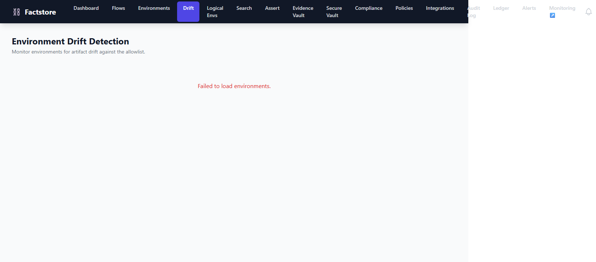

### Key Elements

| Element | Description |
|---------|-------------|
| Environment drift cards | Per-environment list of drifted artifacts |
| Drift indicator | `DRIFTED` (red) vs `IN_SYNC` (green) status per environment |
| Artifact digest + expected vs actual | Shows what should be running vs what is |

### Activity: Remediating a drifted environment

1. Navigate to `/drift`.
2. Identify environments with a `DRIFTED` status.
3. For each drifted artifact, check whether a compliant build exists in the Evidence Vault.
4. Re-deploy the compliant artifact digest to restore `IN_SYNC` status.

---

## 14. Search

**Navigate to:** `/search`

Global Search allows you to find trails, artifacts, and attestations by branch name, author, image name, or SHA256 digest.

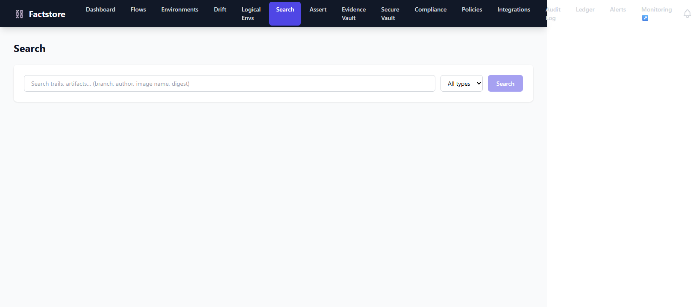

### Key Elements

| Element | Description |
|---------|-------------|
| Search input | Accepts branch names, author identities, image names, or `sha256:` digests |
| **Type** filter | Scopes results to `trail`, `artifact`, or `attestation` |
| Result rows | Linked to the corresponding detail pages |

### Activity: Finding all builds for a specific branch

1. Navigate to `/search`.
2. Type the branch name (e.g. `feature/payment-refactor`) into the search input.
3. Set the **Type** filter to `trail`.
4. Press **Search** or hit Enter.
5. Click any result row to open the trail detail view.

---

## 15. Troubleshooting

### The UI shows "Loading…" indefinitely

The frontend is unable to reach the backend API. Verify:

1. The backend is running on `http://localhost:8080`.
2. The Vite dev proxy is configured — check `frontend/vite.config.ts` for a `/api` → `http://localhost:8080` proxy entry.
3. There are no CORS errors in the browser console.

### All pages show empty state ("No flows found", "No environments found", etc.)

This is expected on a fresh install. The database starts empty. Use the CLI or API to seed initial data:

```bash
# Create your first Flow
curl -X POST http://localhost:8080/api/v1/flows \
  -H "Content-Type: application/json" \
  -d '{"name":"my-service","description":"Example flow","requiredAttestationTypes":["junit"]}'
```

### The Assert page returns "NON_COMPLIANT" unexpectedly

Check that:

1. A **Trail** exists for the artifact digest you are asserting.
2. All attestation types listed in the Flow's `requiredAttestationTypes` have been submitted with a `PASSED` status.
3. The digest you entered matches exactly (copy from the Docker image manifest — do not use a tag).

### Screenshots in this guide appear blank or show an error state

Screenshots are generated against the **empty-state** UI (no backend data seeded). This is intentional — they demonstrate the layout and controls. To regenerate with live data, seed the backend and then run:

```bash
cd frontend
npm run test:e2e
```

> **Note:** The dev server (`npm run dev`) must be running before executing E2E tests.

---

*Generated from Playwright E2E tests in `frontend/e2e/factstore.spec.ts`. Screenshots stored in `docs/public/screenshots/`.*
